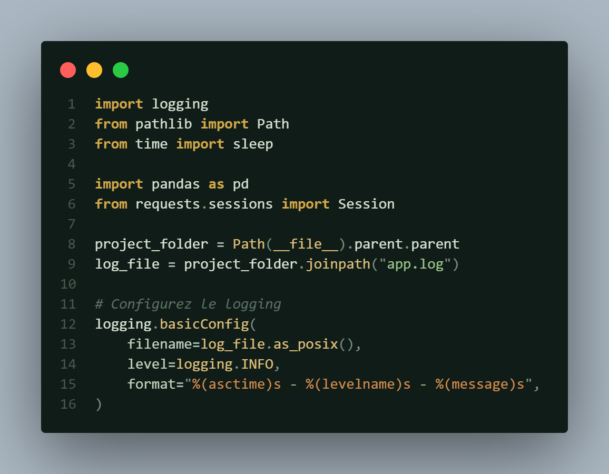

# Laurë

> **Laurë** (*Quenya*): "Golden light or color"

**Laurë** is a collection of Visual Studio Code themes inspired by the world of J.R.R. Tolkien. Designed to bring serenity and elegance to your development environment, its color palette focuses on warm, luminous tones reflecting the radiance of Quenya.

---

## Preview
### Core Palette Overview

| Swatch | Color Name | Hex Code | Role / Usage |
| :---: | :--- | :--- | :--- |
|  | **Deep Canopy** | `#101c17` | Main Editor Background |
|  | **Shadow Pine** | `#0b1411` | Activity Bar, Status Bar & Top Chrome |
|  | **Mossy Grove** | `#0e1815` | Side Bar, Panels & Inactive Tabs |
|  | **Pale Birch** | `#d8e2d3` | Main Foreground Text |
|  | **Golden Laure** | `#d4a949` | Keywords, Badges & Focus Highlights |
|  | **Sunlit Amber** | `#e0c07a` | Functions, Active Selection & Highlights |
|  | **Spring Leaf** | `#9bc48a` | Strings, Added Git Lines |
|  | **Warm Ochre** | `#d98f4e` | Numbers, Constants, Modified Git Lines |
|  | **Sage Stream** | `#7fa89c` | Docstrings, Bracket Guides, Links |
|  | **Dusk Lavender** | `#b79bc9` | Python `self` / `cls` & Special Symbols |

---

  

## Installation
*Guide coming soon*

---

## Feedback & Contributions

Suggestions and feedback are welcome. Feel free to open an issue on the repository for any comments or improvement proposals.